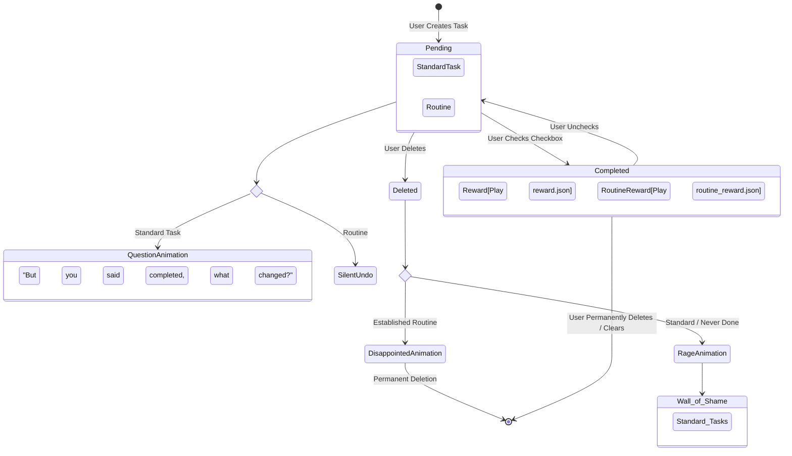
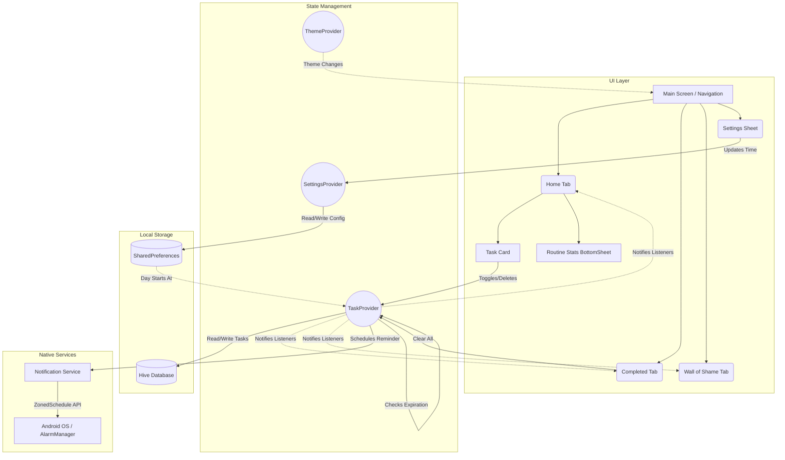

# TickOn ✅

Hey! I'm Revanth. Welcome to **TickOn**, a beautifully designed, highly unapologetic to-do and routine management app. 

I built this app because I needed something more than just a digital checklist. I needed an app that held me accountable. TickOn is built to reward you when you're productive, and brutally call you out when you slack off or abandon your habits. 

If you are giving up on a routine you committed to, prepare to be judged.

## 🌟 Why TickOn is Different

*   **Smart Routines with Tracking**: Not just checkboxes. Tapping a routine card slides up your statistics—when you started, total days completed, and your current streak!
*   **The Wall of Shame**: Deleted a task because you were too lazy to do it? It doesn't disappear. It gets logged on the Wall of Shame for you to look at. *(Add tasks with care, you've been warned!)*
*   **Rage & Disappointment Logic**:
    *   Delete a standard task? The app calls you a coward.
    *   Delete a habit you've already started? The app tells you it's disappointed. 
    *   Uncheck a task you already said was done? The app asks why you lied to it.
*   **Task-Specific Notifications**: Never miss a beat with precise scheduling and native push notifications.
*   **Rapid Ticking Easter Egg**: Try to spam the checkboxes and see what happens!
*   **Beautiful Aesthetics**: Smooth Lottie micro-animations, a clean Bottom Navigation layout, responsive dark mode, and Google Fonts (`Outfit`).
*   **Local First**: 100% offline and blazingly fast using Hive database.

---

## 🏗️ Architecture & Logic Flows

To understand how the app manages state, storage, and the emotional lifecycle of a task, check out these flowcharts!

### The Task Lifecycle (The Emotional Journey)

### Global App Architecture

---

## 🚀 Getting Started

### Prerequisites
*   Flutter SDK (3.0 or higher)
*   Android Studio / Xcode for emulators

### Installation
1.  Clone the repository: `git clone https://github.com/yourusername/tickon.git`
2.  Navigate to the project: `cd tick_on`
3.  Install dependencies: `flutter pub get`
4.  Generate Hive models: `flutter pub run build_runner build --delete-conflicting-outputs`
5.  Run the app: `flutter run`

---
Built with Flutter, Hive, and a lot of passion by Revanth.
